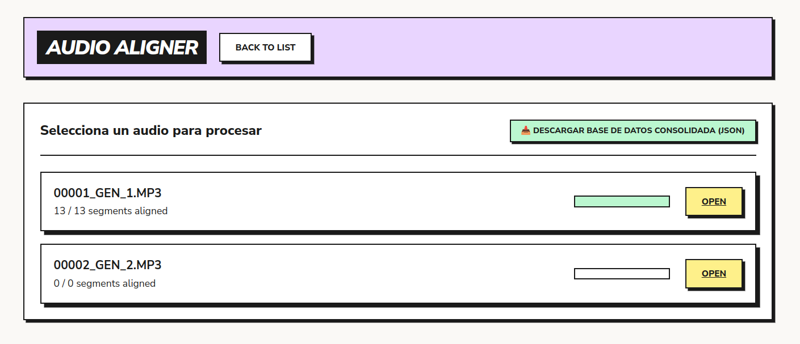

# Audio Aligner

A web-based, semi-automated service for aligning audio recordings with their corresponding text transcriptions. This tool facilitates the creation of time-aligned text for applications like synchronized highlighting during audio playback, or exporting alignments to third-party tools like ELAN.

## Preview



---

## Project Features

The Audio Aligner service runs on a Flask backend and offers a multi-user workspace structured around **Projects** and **Tracks**:

1. **User Authentication:** Simple signup and login system to partition workspaces securely.
2. **Project Workspace & Predefined Workflows:** Create logical project containers (e.g. *Bible*, *Verbal Art*) matching one of three predefined workflows:
   - **Solo segmentación (Segmentation Only):** Requires only an audio file. Used to partition long audio files by silences and adjust timings without text elements.
   - **Segmentación y transcripción (Segmentation & Transcription):** Requires only an audio file. Users split audio tracks and type the transcription directly segment-by-segment in Stage 2.
   - **Segmentación y alineamiento (Segmentation & Alignment):** Requires both audio and text files. Original aligner behavior, allowing users to map segments to spans highlighted from preloaded text.
3. **Interactive Track Uploads:** Upload audio (.mp3/.wav) and transcription scripts (.txt). The text file upload is dynamically made required or hidden based on the workspace type.
4. **Segmentation (Stage 1):** Suggests split points using automated silence detection. Exposes parameters directly in the UI:
   - **Minimum silence length (ms)**
   - **Silence threshold (dB)**
   - **Target segment duration (s)**
   - Includes a **Waveform Zoom** slider.
5. **Alignment & Tuning (Stage 2):** Play segment audio and align it:
   - Highlight the corresponding text in the transcription panel, which automatically copies it to the segment input.
   - Edit the segment text directly in the active segment transcription box.
   - **Playback Speeds:** Select slow-playback options (`0.5x`, `0.75x`) alongside standard rates (`1x`, `1.5x`, `2x`).
   - **Fine-Tune Timings (Re-segmentation):** Adjust the start/end boundaries of the active segment dynamically by `+/- 0.1` seconds without going back to Stage 1.
   - Zoom controls are also available for the segment waveform.
6. **ELAN Export:** Export time-aligned transcriptions to native ELAN `.eaf` XML files containing a single transcription tier with millisecond precision.
7. **Consolidated Migration:** When a user first registers, the server searches for legacy local `config.json` and `state.json` files and automatically migrates them into a project named *Toba Bible (Imported)*.

---

## Directory Structure

*   `app.py`: Main Flask application handling routing, session auth, API endpoints, and server settings.
*   `database.py`: Encapsulates SQLite database connection, table initialization, and CRUD helpers.
*   `elan_exporter.py`: Utility module generating ELAN `.eaf` format XML documents.
*   `process_bible.py`: Legacy utility script to extract chapter-wise text files from bulk sources.
*   `config.json`: (Legacy) Defines default audio-text pairs used during database seeding.
*   `state.json`: (Legacy) Preserves legacy local alignment progress used during database seeding.
*   `uploads/`: Folder containing source audio files and text files, now sorted under project subfolders.
*   `static/`:
    *   `js/main.js`: Core frontend logic, Wavesurfer.js integration, play rate bindings, and API calls.
    *   `css/style.css`: Neo-Brutalist UI styling.
*   `templates/`:
    *   `base.html`: Main layout template with styling and navigation menus.
    *   `login.html`: Neo-Brutalist user login screen.
    *   `register.html`: User registration screen.
    *   `dashboard.html`: Project dashboard listing available work units.
    *   `project_detail.html`: Workspace detail panel displaying tracks, completion gauges, and upload forms.
    *   `index.html`: The main alignment editor page.

---

## Setup and Running

### Method 1: Running Locally

#### Prerequisites
*   Python 3.x
*   FFmpeg (required by `pydub` to slice audio tracks)

#### Installation
1. Create and activate a virtual environment:
   ```bash
   python -m venv venv
   source venv/bin/activate  # On Windows: venv\Scripts\activate
   ```
2. Install dependencies:
   ```bash
   pip install -r requirements.txt
   ```
3. Run the Flask application:
   ```bash
   python app.py
   ```
   Open `http://localhost:5000` in your web browser.

---

### Method 2: Running with Docker (Recommended)

You can run the entire application containerized without manually installing python or FFmpeg on your host machine.

#### Prerequisites
*   Docker and Docker Compose installed.

#### Run Command
Start the containers in the background:
```bash
docker compose up -d --build
```
The application will be running at `http://localhost:5000`. 
Data directories (`uploads/`) and database files (`aligner.db`) are bound as volumes on the host system to ensure persistence across container updates.

---

## Development Conventions

*   **State Management:** All user alignment actions are synced to the backend database via `/api/save_state` API calls in JSON format and written into SQLite.
*   **Keyboard Hotkeys:**
    *   `Space`: Play/Pause the active segment (when not typing in a text field).
    *   `Ctrl + Enter`: Assign transcription text to the active segment and advance.
